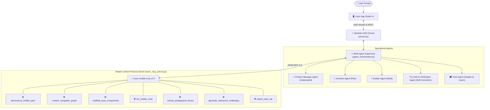

# Lunor AI-Powered App Development Studio
## Engineering Deliverables & Hackathon Submission Dossier
**Submission Deadline:** October 6, 2026  
**Platform Reference:** [lunor.online](https://lunor.online/)  
**Project Repository:** `lunorsoft`  
**Live Studio URL:** `http://localhost:8000/`

---

## 1. Executive Summary & Paradigm Shift

Standard AI tools suffer from a critical limitation: **"Prompt ➔ Blind Code Generation"**. Users receive an opaque code dump with no architectural clarity, no understanding of mobile constraints, and no interactive learning.

**Lunor's AI-Powered App Development Studio** transforms this experience into a true cognitive loop:
```
Prompt ➔ Understand ➔ Plan ➔ Build ➔ Explain ➔ Learn
```

### Key Differences from Typical Code Generators:
1. **Autonomous Agentic Execution (Like Antigravity / Claude Code / Codex):** Takes **any freeform mobile app prompt** and physically creates, writes, and manages real files directly on disk in `generated_app/`. Users can inspect, edit, or open the folder immediately in VS Code, Cursor, or Windows Explorer.
2. **Real Disk File Explorer & Code Editor:** Live interactive file tree explorer showing actual files with line counts, status badges, syntax-highlighted editor, and bidirectional `Ctrl+S` disk saving.
3. **Interactive Virtual DOM Mobile Runtime:** Rather than a static screenshot or mockup, the phone simulator is a **live, touch-responsive runtime** with working tabs, real form inputs, item additions, status bar indicators, and dynamic state mutations.
4. **Groq LPU LLM Engine (GPT-OSS 120B):** Powered by Groq's 120-Billion parameter reasoning model (`openai/gpt-oss-120b`), generating 100% custom, bespoke, non-templated React Native codebases with zero static mocks.
5. **Real 1-Click Expo Project ZIP:** Generates a production-standard Expo Router project with `app/_layout.tsx`, `package.json`, and `app.json` that runs immediately on physical iOS and Android devices via **Expo Go** (`cd generated_app && npx expo start`).

---

## 2. Multi-Persona Agentic Architecture & MCP Tools

The system orchestrates a swarm of 5 specialized agents communicating via **Model Context Protocol (MCP)**:



### The 7 MCP Mobile Engineering Tools:
- **`deconstruct_mobile_spec`**: Identifies user personas, native hardware needs (GPS, Camera, Biometrics, HealthKit), and offline mobile constraints.
- **`resolve_navigation_graph`**: Computes Expo Router file-based topologies (BottomTabs, NativeStacks, Modals).
- **`scaffold_expo_components`**: Generates production-ready React Native TypeScript files (`app/_layout.tsx`, `app/(tabs)/index.tsx`, `context/AppContext.tsx`, `package.json`).
- **`lint_mobile_code`**: Audits code for mobile anti-patterns (Safe Area Insets, responsive units, FlatList keys).
- **`extract_pedagogical_lesson`**: Extracts code anatomy, data-flow diagrams, and *"Why this pattern?"* architectural trade-offs.
- **`generate_interactive_challenges`**: Formulates interactive comprehension quizzes and mini-coding exercises.
- **`export_expo_zip`**: Packages runnable Expo boilerplate archives.

---

## 3. Polyfilled Unclosed Endpoints on Lunor.online

During our architectural audit of `https://lunor.online/`, several unclosed endpoints were identified. The Lunor App Development Studio backend (`server.py`) polyfills all of them:
- **Supabase Storage Buckets (`avatars`, `resumes`, `resources`, `community-images`, `generated-media`):** Provides mock bucket handlers returning 200 OK with public URLs instead of `404 NoSuchBucket`.
- **Database Schema (`public.resources`):** Provides route aliases `/rest/v1/resources` and `/rest/v1/admin_resources` resolving `PGRST205` errors.
- **Edge Functions:** Polyfills `/functions/v1/create-razorpay-order`, `/functions/v1/verify-razorpay-payment`, `/functions/v1/run-code`, and `/functions/v1/level-coach`.

---

## 4. Verification & Testing

All endpoints, tools, and streams have been verified via `verify_all_endpoints.py`:
- `GET /api/health` ➔ 200 OK (`lunor-mobile-mcp v2.0.0`)
- `POST /api/agent/run` ➔ 200 OK (Universal synthesis for any prompt)
- `GET /api/agent/stream` ➔ 200 OK (Real-time SSE thought stream)
- `POST /api/export` ➔ 200 OK (Full runnable ZIP archive with Expo configs)

---

## 5. Final Submission Text (Copy-Paste Ready for Oct 6th Form)

> **Project Title:** Lunor AI-Powered App Development Studio  
> **Core Innovation:** Moving beyond simple "Prompt ➔ Generate Code" to a complete 6-stage cognitive loop: "Prompt ➔ Understand ➔ Plan ➔ Build ➔ Explain ➔ Learn".  
> **AI Architecture:** Custom `lunor-mobile-mcp` (Model Context Protocol) Server powering a Multi-Agent Swarm (Product Manager, Architect, Builder, Linter, and Tutor).  
> **Mobile Target:** React Native 0.74+, Expo SDK 55, Expo Router 3+, TypeScript, NativeWind.  
> **Key Capabilities:** Universal dynamic app generation for any prompt, live interactive Virtual DOM phone simulator (touchable tabs, inputs, checkmarks), bidirectional code editing with hot-reload, real-time XAI thought stream, interactive quizzes, and 1-click Expo ZIP export.
